# VLearn

> P/L desktop berbasis Windows untuk memudahkan pelanggan mencari video pembelajaran yang diinginkan.

## Table of Contents

- [VLearn](#vlearn)
  - [Table of Contents](#table-of-contents)
  - [General Information](#general-information)
  - [Technologies Used](#technologies-used)
    - [Languages](#languages)
    - [Frameworks / Libraries](#frameworks--libraries)
  - [Features](#features)
  - [Demo](#demo)
  - [Setup](#setup)
  - [Usage](#usage)
  - [Database](#database)
  - [Developer](#developer)

## General Information

 VLearn merupakan P/L desktop berbasis Windows dibuat sebagai sumber video pembelajaran yang akan memudahkan pelanggan dalam mencari video pembelajaran yang diinginkannya. Terdapat beberapa fitur yang ditawarkan oleh P/L ini, di antaranya adalah pelanggan dapat mendaftarkan akun, melakukan login, melihat daftar seluruh video pembelajaran, melakukan isi ulang saldo, membeli video pembelajaran, mendapatkan akses ke video pembelajaran, memberikan penilaian kepada video pembelajaran berupa rating berupa angka 1 sampai 5 dan review berupa paragraf, dan melihat seluruh video yang telah dibeli. Dengan adanya P/L ini, masyarakat yang membutuhkan video pembelajaran diharapkan dapat menemukan video pembelajaran yang diinginkan dengan mudah.  
  

_P/L ini dibangun sebagai pemenuhan Tugas Besar IF2250 Rekayasa Perangkat Lunak Semester II 2021/2022._

## Technologies Used

### Languages

- Python

### Frameworks / Libraries

- PyQt5
- Pylint
- Coverage
- isort
- Pytest
- Faker
- argon2

## Features

Fitur yang dihadirkan oleh P/L ini adalah:

- Pelanggan dapat melakukan registrasi dan login sebagai pengguna P/L
- Pelanggan dapat melihat daftar course yang tersedia dan course yang telah dibeli
- Pelanggan dapat melakukan isi ulang saldo
- Pelanggan dapat membeli course yang tersedia
- Pelanggan dapat melihat detail course yang tersedia
- Pelanggan dapat menerima situs yang berisi video pembelajaran yang telah dibeli
- Pelanggan dapat memberikan rating dan review pada course yang telah dibeli

## Demo

- Melakukan registrasi dan login 
  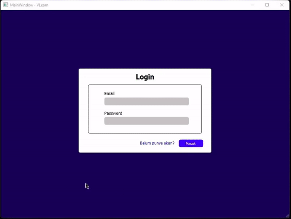
   
- Melakukan isi ulang saldo dan pembelian course 
  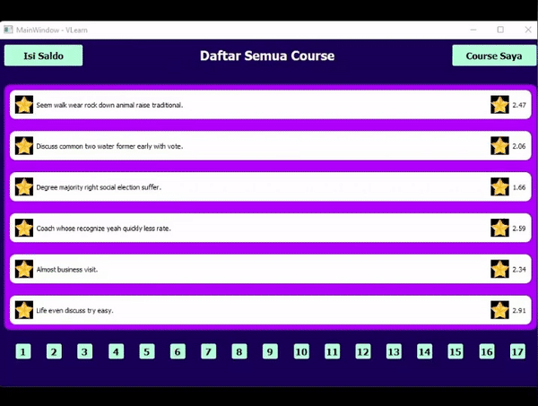
   
- Melihat detail course, menonton video, dan memberikan rating dan review 
  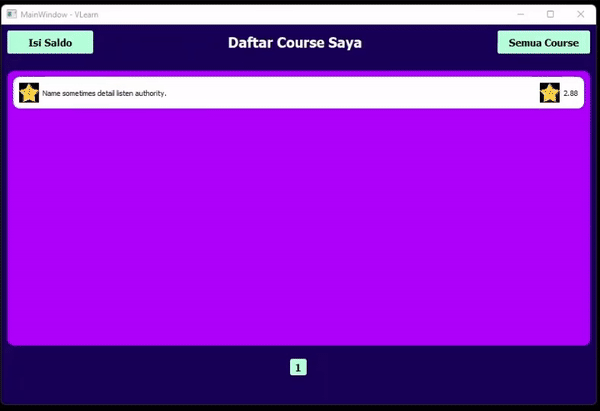

## Setup

1. Clone repository ini terlebih dahulu.
2. Pastikan anda berada di folder repository yang telah di clone.
3. Jalankan perintah `pip install .` untuk install package ini.

## Usage

1. Pastikan Anda berada di folder utama dari P/L ini.
2. Jalankan perintah `python -m vlearn` untuk memulai P/L ini.
3. Apabila database belum dibuat, program akan membuat database baru pada direktori `db` dengan nama `database.db`.
4. Apabila database ingin diisi oleh seeder yang disediakan oleh program, terminasi P/L, kemudian jalankan perintah `python -m vlearn.models.seeder`. Setelah pengisian database berhasil, dapat kembali menjalankan perintah `python -m vlearn`.
5. Jika P/L berhasil dijalankan maka akan muncul jendela baru dengan tampilan awal berupa form Login.
6. Pengguna dapat melakukan Login jika telah memiliki akun atau dapat melakukan registrasi sebagai pengguna baru.
7. Setelah berhasil login, maka akan muncul jendela baru dengan tampilan awal berupa daftar course yang tersedia. Selanjutnya pelanggan dapat melakukan pengisian saldo, pembelian course, menonton video, dan memberikan rating dan review.

## Modules

Modul yang diimplementasikan pada P/L ini adalah sebagai berikut:

| Nama Modul | Isi Modul | NIM dan Nama PIC | Capture Screen |
| ---------- | --------- | ---------------- | -------------- |
| otentikasi (login, register) | Controller auth.py   Model pengguna.py   View auth_display.py | > 13520103 Amar Fadil (Controller, Model)   > 13520039 Rozan Fadil Al Hafidz (View) | 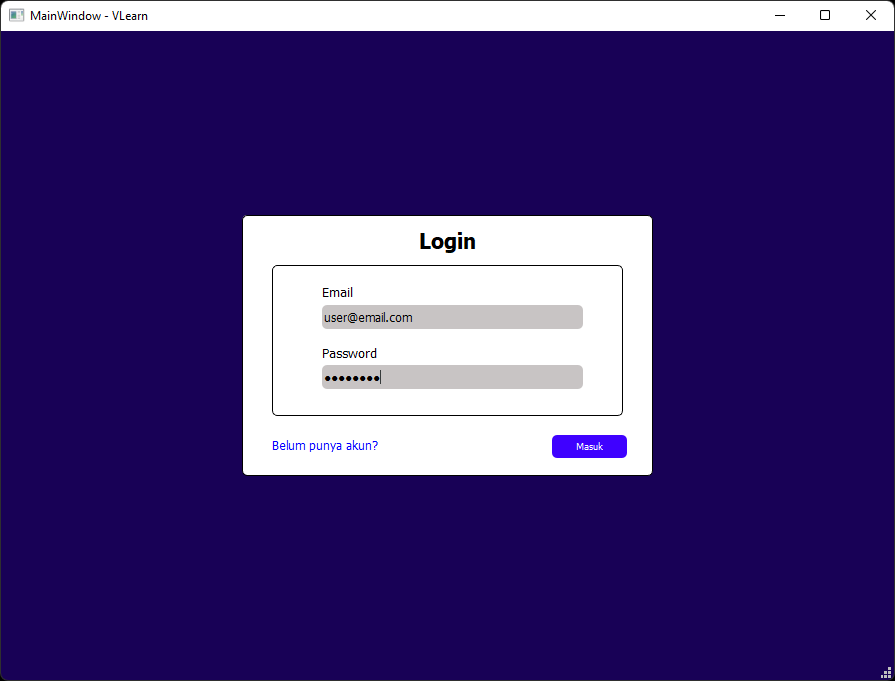   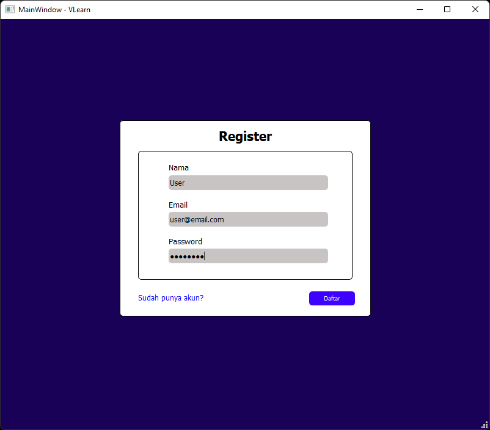 |
| list available course | Controller course.py   Model course.py   View list_course_display.py | > 13520103 Amar Fadil (Controller, Model)   > 13520105 Malik Akbar HR (View) | 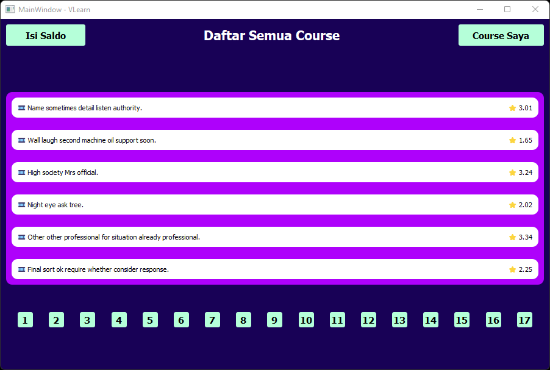   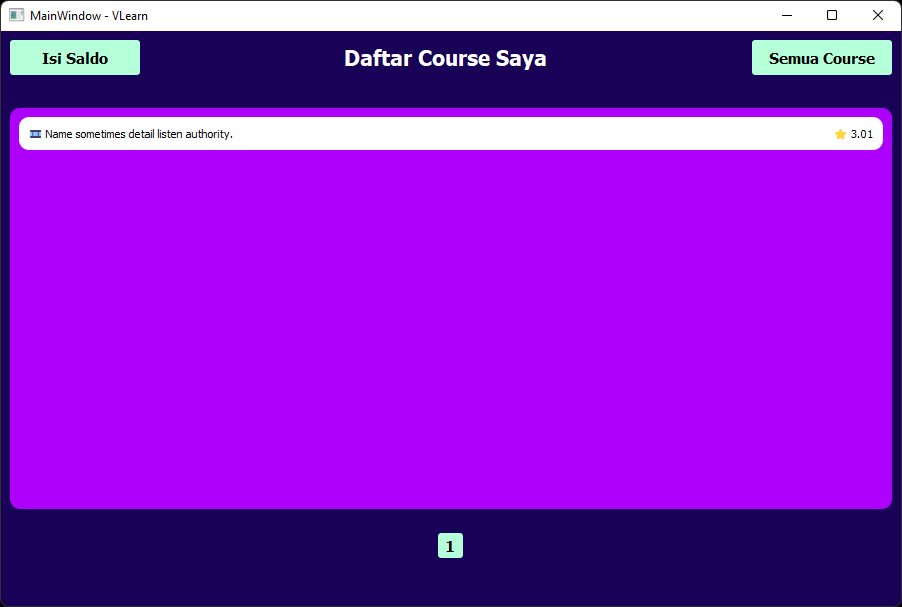 |
| beli course | Controller pembelian_course.py   View beli_course_display.py | > 13520105 Malik Akbar HR (Controller, View) | 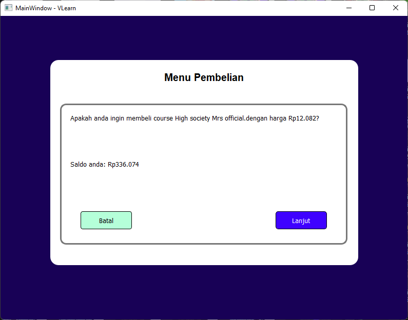 |
| detail course | Controller course.py, tanggapan.py   Model course.py, review.py, tanggapan.py   View detail_course_display.py, beri_tanggapan_display.py | > 13520103 Amar Fadil (Controller, Model course.py)   > 13520139 Fachry Dennis Heraldi (Model tanggapan.py)   > 13520039 Rozan Fadil Al Hafidz (Model review.py, View) | 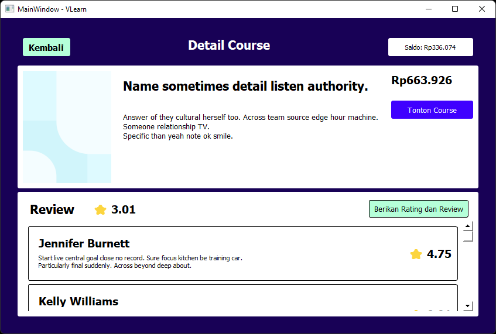   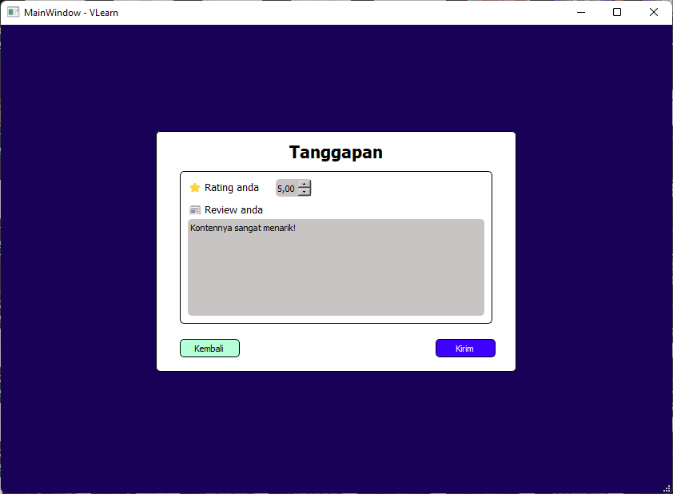 |
| isi saldo | Controller saldo.py   View isi_saldo_display.py | > 13520139 Fachry Dennis Heraldi (Controller, View) | 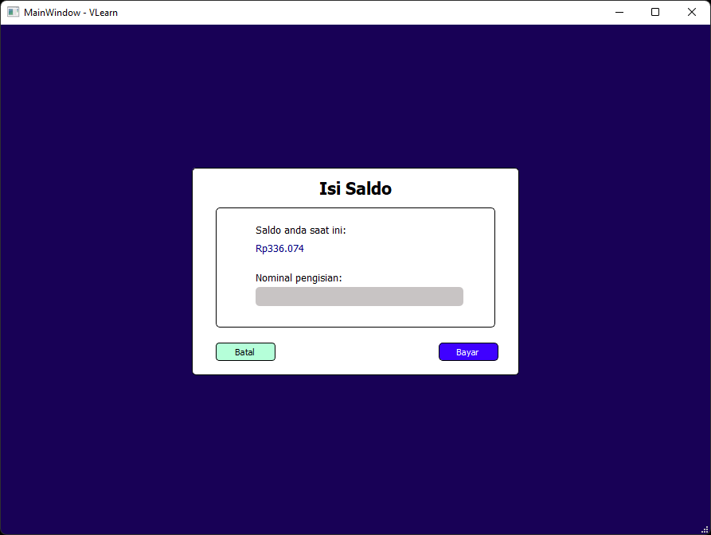 |

## Database

|   Nama Tabel    | Atribut                                                       | Deskripsi                                                      |
| :-------------: | ------------------------------------------------------------- | -------------------------------------------------------------- |
|    pengguna     | [id_pengguna, nama, email, password, role, saldo, session_id] | Berisi data-data yang berkaitan dengan identitas pengguna      |
|     course      | [id_course, judul, deskripsi, harga, link_video, durasi]      | Berisi data-data yang mengandung informasi course              |
| course_pengguna | [id_course, id_pengguna, waktu_pembelian]                     | Berisi data-data id_course yang sudah dibeli oleh pengguna     |
|    tanggapan    | [id_review, id_pengguna, id_course, nilai_rating]             | Berisi data-data tanggapan course yang dibuat seluruh pengguna |
|     review      | [id_review, isi_review]                                       | Berisi data-data review yang terdapat pada course              |

## Developer

Dibuat oleh Kelompok 04 K01 IF2250 Rekayasa Perangkat Lunak Semester 2 2021/2022.

1. Rozan Fadhil Al Hafidz (13520039)
2. Amar Fadil (13520103)
3. Malik Akbar Hashemi Rafsanjani (13520105)
4. Fachry Dennis Heraldi (13520139)
